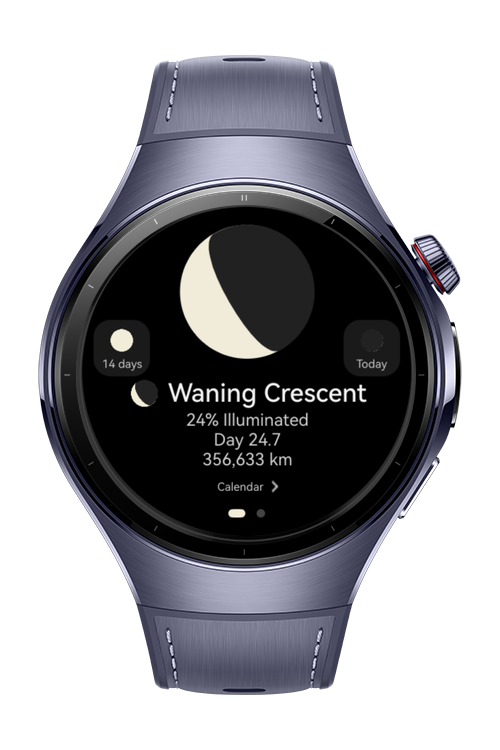
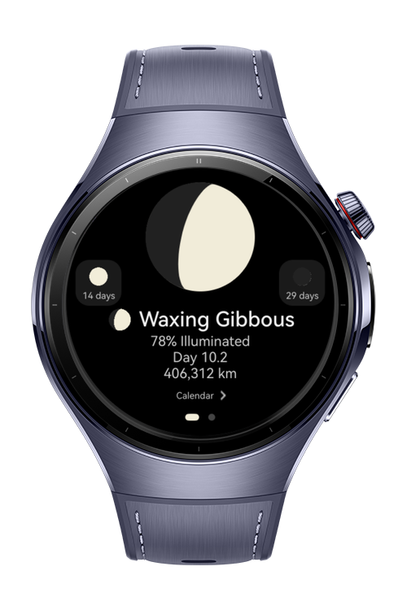
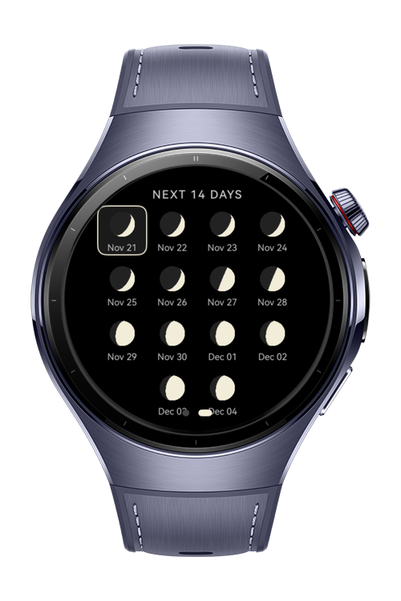

> **Note:** To access all shared projects, get information about environment setup, and view other guides, please visit [Explore-In-HMOS-Wearable Index](https://github.com/Explore-In-HMOS-Wearable/hmos-index).

# MoonPhases

A moon phases app with offline algorithmic calculations.

# Preview

<p align="left">
  
  
  
  
</p>

# Use Cases

- **Stargazing**: Determine the best nights for observing celestial objects based on moon brightness (e.g., darker skies during new moon).
- **Astronomy Enthusiasts**: Track and visualize current and upcoming moon phases without requiring an internet connection.
- **Photographing**: Plan outdoor shoots by checking moon phases for optimal lighting conditions (e.g., full moon for night photography).
- **Outdoor Activities**: Prepare for hikes/camping trips by monitoring moon brightness for nighttime visibility.

# Tech Stack

- **Framework:** HarmonyOS SDK (ArkTS/ArkUI)
- **UI Components:**
  - Dynamic Lottie Animation using custom frames and ease-in stop animation
  - UI optimized for OLED display(Pure black backgrounds for better battery life and performance)
- **Calculation Logic:**
  - Offline Algorithmic approach using **Lunar Cycle Information** and **Last Known New Moon(2000-01-06)**


# Directory Structure

```
WeatherVoice/
│
├── entry/
│   └── src/
│       └── main/
│           ├── ets/
│           │   ├── components/
│           │   │   ├── MoonPhaseIcon.ets        # Unified Moon Phase Icon Component
│           │   │   ├── MoonPhaseLottie.ets      # Dynamic Lottie Animation Based on the Current Moon
│           │   │   └── TextComponents.ets       # Unified Text Components for Consistency
│           │   ├── pages/                          
│           │   │   ├── Index.ets                # Main Page with Swiper Component
│           │   │   ├── MoonPage.ets             # Page with Today's Detailed Moon Phase Info
│           │   │   └── CalendarPage.ets         # 14-Day Calendar
│           │   ├── utils/
│           │   │   └── MoonCalculator.ets       # Algorithmic Offline Moon Data Calculations
│           └── resources/
│               ├── base/
│               │   └── element/
│               │   │   ├── color.json           # Unified Colors
│               │   │   └── float.json           # Unified App Styles
│               └── rawfile/
│                   └── (Lottie and png files)
```

# Constraints and Restrictions

## Supported Devices;
  - Huawei Watch 5

# License

**MoonPhases** is distributed under the terms of the MIT license. See the [LICENSE](LICENSE) for more information.
